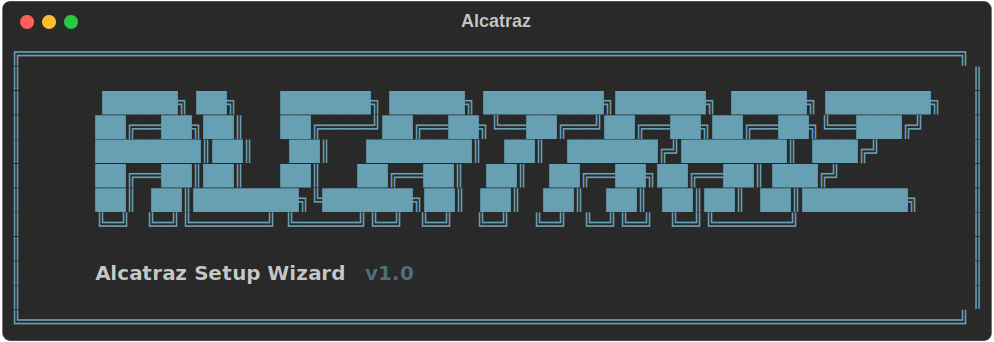

<p align="center">
  
</p>

# Alcatraz

An overlay for using bypass permissions/skip-permissions dangerously Claude Code with Docker, Git Guardian protection, security layers, and team-safe defaults.

---

## Disclaimer

This software is provided as-is, without warranty of any kind. While Alcatraz implements multiple security layers (Docker sandboxing, Git Guardian, permission controls, resource limits), **no tooling can guarantee complete safety** when running autonomous AI agents.

- **`--dangerously-skip-permissions` is intentional.** The Docker container itself acts as the sandbox. Git Guardian handles git-specific safety. This is a deliberate architectural choice — review the [Security Architecture](#security-architecture) section to understand the trade-offs.
- **You are responsible** for reviewing Claude's actions, using branch protection, working on feature branches, and exercising appropriate oversight of autonomous operations.
- **Review before trusting.** Always inspect changes Claude makes before merging to protected branches.

By using this software, you acknowledge these limitations and accept responsibility for its use.

---

## Security Architecture

Alcatraz uses a layered security model. No single layer is sufficient on its own — they work together to constrain what Claude can do.

| Layer | What It Protects | Enforcement Level |
|-------|-----------------|-------------------|
| **Docker container** | Host filesystem isolation | OS-level (kernel) |
| **PAT scoping** | GitHub permissions (contents only, no admin) | Server-side (GitHub) |
| **Branch protection** | Protected branches via `branch-ruleset.json` | Server-side (GitHub) |
| **Git Guardian** | Dangerous git commands (force push, branch delete, hard reset) | Binary wrapper (container) |
| **settings.json deny list** | Blocked command patterns | Application (Claude Code) |
| **PreToolUse hook** | Additional command filtering | Application (Claude Code) |
| **Resource limits** | CPU and memory caps (optional) | OS-level (Docker cgroups) |

### How the token is protected

The GitHub PAT is stored on the host at `~/.alcatraz-token` with `600` permissions. At container launch, it is written to a root-owned file inside the container (`/root/.git-credentials`). The `node` user (which Claude runs as) cannot read this file directly. Git accesses the token through a credential helper that runs via a restricted `sudo` rule — limited to exactly the commands needed for credential retrieval.

The PreToolUse hook blocks direct attempts to read the credential file, and the container's sudoers policy restricts `sudo` to a fixed set of commands (no general-purpose root access).

### What Claude can and cannot do

| Action | Allowed? | Why |
|--------|----------|-----|
| Read/write files in the mounted project | Yes | This is the intended workflow |
| Push to feature branches | Yes | Normal development workflow |
| Force push to any branch | Blocked | Git Guardian prompts for confirmation |
| Push to protected branches | Blocked | Git Guardian + GitHub branch protection |
| Delete remote branches | Blocked | Git Guardian prompts for confirmation |
| Access the raw GitHub token | Blocked | Root-owned file + restricted sudo + PreToolUse hook |
| Access host filesystem outside the mount | Blocked | Docker container isolation |
| Install system packages | Blocked | No general sudo access |
| Access the network (optional) | Configurable | Launch with `none` for full network isolation |

### Branch ruleset

The generated `branch-ruleset.json` is the recommended way to protect your default branch. Import it on each repo to enforce server-side rules that Claude cannot bypass — no direct pushes to main, no force-pushes, no branch deletion.

**To apply it:**

1. Go to your repo **Settings → Rules → Rulesets**
2. Click **New ruleset → Import a ruleset**
3. Upload `branch-ruleset.json` from your install directory
4. Review and click **Create**

Repeat for every repo the PAT has access to. The ruleset enforces:

| Rule | Effect |
|------|--------|
| Restrict deletions | Default branch cannot be deleted |
| Block force pushes | History cannot be rewritten |
| Require pull request | PR required, 0 approvals default (increase to 1+ for teams) |

These are server-side rules — Claude cannot bypass them regardless of what happens inside the container.

### Secrets in your project

The mounted project directory is fully readable by Claude inside the container. If your project contains `.env` files, API keys, or other secrets, Claude can access them. Mitigations:

- **Do not store production secrets in the repo.** Use a secrets manager and only keep `.env.example` templates in git.
- **Add `.env` to `.gitignore`.**
- **For sensitive projects**, launch with `--network none` so Claude cannot make outbound connections even if it reads local secrets.

---

## Table of Contents

- [Quick Start](#quick-start)
- [What It Does](#what-it-does)
- [Requirements](#requirements)
- [Generated Files](#generated-files)
- [Profiles](#profiles)
- [Daily Workflow](#daily-workflow)
- [Multiple Projects](#multiple-projects)
- [Maintenance](#maintenance)
- [Quick Reference](#quick-reference)
- [Troubleshooting](#troubleshooting)
- [Customising the Dockerfile](#customising-the-dockerfile)
- [Headless / Non-Interactive Mode](#headless--non-interactive-mode)

## Quick Start

**Linux / macOS:**
```bash
./install.sh
```

**Windows:** Double-click `windowsInstall.bat` from File Explorer. This launches the wizard automatically via WSL.

The wizard handles everything else — 15 guided steps from configuration through to first launch.

## What It Does

| Step | Description |
|------|-------------|
| 1. Pre-flight | Verifies Docker, Git, and Bash are installed and running |
| 2. Directory | Choose where to create the setup files |
| 3. Profile | Pick Recommended / Minimal / Full / Custom component sets |
| 4. Git Guardian | Configure protected branches and push behaviour |
| 5. Network | Set default network mode and port forwarding |
| 6. Security | Toggle deny lists, hooks, timeouts, resource limits |
| 7. Generate | Creates all configuration files |
| 8. GitHub PAT | Step-by-step guide to create a scoped access token |
| 9. Token Storage | Securely store the PAT for container access |
| 10. Docker Build | Build the Docker image (with live progress) |
| 11. Claude Auth | One-time OAuth login for Claude Code |
| 12. Project Settings | Deploy `.claude/settings.json` to your project |
| 13. Branch Protection | Import the included branch ruleset into GitHub |
| 14. Install Launcher | Add `alcatraz` command to PATH |
| 15. Daily Workflow | Usage patterns and maintenance tips |

If you exit early after Step 7, you can complete the remaining steps manually:

1. `cd <install-dir> && ./build.sh`
2. Store your GitHub PAT in `~/.alcatraz-token`
3. Import `branch-ruleset.json` on each repo (Settings → Rules → Rulesets → Import)
4. Authenticate Claude Code (one-time OAuth login)
5. `ln -sf <install-dir>/alcatraz ~/.local/bin/alcatraz`
6. `alcatraz /path/to/project`

## Requirements

- **Python 3.8+** (only for the wizard itself — not needed after setup)
- **Docker** installed and running
- **Git** installed
- **Bash** shell (native on macOS/Linux, WSL on Windows)

The wizard auto-installs its Python dependencies (`rich`, `questionary`) on first run.

## Generated Files

The wizard creates the following in your chosen install directory:

```
<install-dir>/
├── Dockerfile              # Custom Docker image based on your profile
├── git-guardian.sh         # Safety wrapper around git commands
├── run.sh                  # Launch script (called by the alcatraz wrapper)
├── alcatraz                # Quick launcher — add to PATH for global access
├── build.sh                # One-command image builder
├── branch-ruleset.json     # GitHub branch protection ruleset (import this)
├── pretool-hook.sh         # PreToolUse safety hook (if enabled)
└── settings.json           # Permission deny list (copy to project .claude/)
```

## Profiles

| Profile | Image Size | Includes | Best For |
|---------|-----------|----------|----------|
| **Recommended** | ~4-5 GB | Core + Cloud CLIs + Infra + Browser | Most teams |
| **Minimal** | ~1.5-2 GB | Core + GitHub CLI | Quick start |
| **Full** | ~7-8 GB | Everything + ML packages | ML/Data teams |
| **Custom** | Varies | You pick each component | Specific needs |

## Daily Workflow

### Starting a session

```bash
# Launch in the current directory
alcatraz

# Or pass the path directly
alcatraz ~/projects/my-project

# Offline mode (no network access)
alcatraz ~/projects/my-project none
```

### Before you start

Always prepare the working tree before handing control to Claude:

```bash
cd ~/projects/my-project
git status                          # Ensure the working tree is clean
git stash                           # Stash uncommitted changes, or commit them
git checkout -b claude/feature-xyz  # Work on a branch, never directly on main
git pull origin main                # Sync latest from main
```

Then launch the container. Claude will see the branch and work on it.

### Pushing and pulling

**Option A: Git Guardian confirmation (recommended)**

Claude can attempt any git operation, but dangerous ones (force push, push to protected branches, branch deletion, hard reset) trigger an interactive confirmation prompt. Regular pushes to feature branches proceed silently.

**Option B: Controlled push access**

With a properly scoped PAT (`Contents: read/write` only) and GitHub branch protection enabled, Claude can push freely to feature branches. The worst case is a messy feature branch, which is trivially recoverable.

**Option C: Offline mode**

Launch with network isolation:

```bash
alcatraz ~/projects/my-project none
```

Claude works entirely locally. When done, review and push from the host:

```bash
git diff                            # Review changes
git log --oneline -10               # Review commits
git push origin claude/feature-xyz  # Push if satisfied
```

### After a session

```bash
cd ~/projects/my-project

git log --oneline -10               # What did Claude commit?
git diff main..HEAD                 # Full diff against main
git diff HEAD~3..HEAD               # Last 3 commits only

# Open a PR
gh pr create --base main --head claude/feature-xyz --title "PR title" --body " "

# Or roll back
git reset --hard HEAD~5             # Undo last 5 commits
git checkout main && git branch -D claude/feature-xyz  # Delete the branch
```

### Resource limits

For long autonomous sessions, cap resource usage via the wizard's Security step, or manually:

```bash
docker run -it --rm \
    --memory 8g \
    --cpus 4 \
    # ... rest of the flags
```

## Launch Modes

The `alcatraz` command accepts optional arguments for network and port modes. Arguments are order-independent — mix them freely.

### Network modes

| Mode | Command | Behaviour |
|------|---------|-----------|
| **Bridge** (default) | `alcatraz /path/to/project` | Claude has internet access — can push, pull, install packages |
| **None** (offline) | `alcatraz /path/to/project none` | Claude works locally only — you push from the host after reviewing |

### Port modes

| Mode | Command | Behaviour | Parallel safe? |
|------|---------|-----------|----------------|
| **Deterministic** (default) | `alcatraz /path/to/project` | Hash-based host ports — run multiple containers without conflicts | Yes |
| **Fixed** | `alcatraz /path/to/project fixed` | 1:1 mapping (3000→3000, 5173→5173) — single container only | No |
| **No ports** | `alcatraz /path/to/project noports` | No port forwarding at all | Yes |

### Combining modes

```bash
alcatraz                                # Current dir, bridge network, deterministic ports
alcatraz /path/to/project               # Explicit path, same defaults
alcatraz /path/to/project none          # Offline, deterministic ports
alcatraz /path/to/project fixed         # Bridge network, fixed ports
alcatraz . fixed none                   # Current dir, offline, fixed ports
alcatraz . noports                      # Current dir, no port forwarding
```

### WSL

From WSL bash, pass the `/mnt/c/...` path:

```bash
alcatraz /mnt/c/Users/you/projects/my-project
```

## Multiple Projects

### One image, multiple containers

You do not need separate Docker images per project. Use the same image and mount different directories:

```bash
alcatraz ~/projects/project-a
alcatraz ~/projects/project-b  # Separate container, separate session
```

Each container is fully isolated and gets destroyed on exit (`--rm` flag).

### Port-aware Claude

The launch script injects `HOST_PORT_*` environment variables and passes them into Claude's system prompt via `--append-system-prompt`. When Claude starts a dev server on container port 3000, it tells you the correct host URL (e.g., `localhost:37593` in deterministic mode, `localhost:3000` in fixed mode). No manual configuration needed.

### Running containers simultaneously

Containers can run side by side in separate terminals. Each gets a unique name (project name + PID):

```bash
docker ps --filter name=alcatraz-
```

### When to use separate images

Build different Docker images only when projects have different system-level dependencies:

| Scenario | Solution |
|----------|----------|
| All projects use Node/Python | One image, mount different dirs |
| A project needs Rust + C toolchain | Build a second image with those deps |
| A project needs GPU access | Build an image with CUDA, use `--gpus` flag |
| Different Node versions per project | Use multi-stage builds or separate images |

## Maintenance

### Rotating your GitHub PAT

GitHub PATs expire. When yours does:

```bash
echo 'github_pat_NEW_TOKEN' > ~/.alcatraz-token
echo 'YYYY-MM-DD' > ~/.alcatraz-token-expiry
```

### Updating the Docker image

Rebuild after changing the Dockerfile or to pick up updated packages:

```bash
cd <install-dir> && ./build.sh
```

Or manually:

```bash
docker build -t alcatraz:latest \
  --build-arg USER_UID=$(id -u) \
  --build-arg USER_GID=$(id -g) \
  <install-dir>/
```

### Cleaning up

```bash
docker image prune -f               # Remove dangling images
docker container prune -f            # Remove stopped containers
```

## Quick Reference

```bash
# Build the image
cd <install-dir> && ./build.sh

# Launch
alcatraz /path/to/project            # With network
alcatraz /path/to/project none       # Offline
alcatraz /path/to/project fixed      # Fixed ports (single container only)
alcatraz                             # Current directory

# Container management
docker ps --filter name=alcatraz-    # List running containers
docker kill <container-name>         # Stop a runaway container
docker logs <container-name>         # View logs

# Git Guardian audit log (during a session)
docker exec <container-name> cat /tmp/git-guardian.log
docker exec <container-name> tail -f /tmp/git-guardian.log

# Branch protection (import on each repo)
# Settings → Rules → Rulesets → New → Import → upload branch-ruleset.json

# Maintenance
echo 'github_pat_...' > ~/.alcatraz-token         # Rotate PAT
echo 'YYYY-MM-DD' > ~/.alcatraz-token-expiry      # Update expiry
docker image prune -f                              # Clean up images
ln -sf <install-dir>/alcatraz ~/.local/bin/alcatraz # Symlink launcher to PATH
# If ~/.local/bin isn't in PATH, add to your shell config:
# echo 'export PATH="$HOME/.local/bin:$PATH"' >> ~/.bashrc && source ~/.bashrc
```

## Troubleshooting

### `chmod: Operation not permitted` (WSL)

WSL cannot set Unix permissions on files that live on the Windows filesystem (`/mnt/c/...`) by default. Add `options = "metadata"` to `/etc/wsl.conf` and restart WSL. The wizard checks for this in Step 1 and shows fix instructions.

### Claude asks to log in every time

**1. `CLAUDE_CODE_OAUTH_TOKEN` is set somewhere (most common).** This env var overrides `.credentials.json` entirely. If it contains a stale value, authentication fails — even `/login` inside the container cannot override it.

```bash
rm -f ~/.alcatraz-oauth-token
grep -r "CLAUDE_CODE_OAUTH_TOKEN" ~/.bashrc ~/.zshrc ~/.profile 2>/dev/null
```

The generated `run.sh` does not set this env var. Authentication is handled by the mounted `.credentials.json`.

**2. Missing or expired credentials.** Re-authenticate:

```bash
docker run -it --rm \
    -v "$HOME/.claude:/home/node/.claude" \
    -v "$HOME/.claude.json:/home/node/.claude.json" \
    alcatraz:latest \
    claude --dangerously-skip-permissions
# Complete the OAuth flow, then /exit
```

**3. Missing onboarding flag.** Claude shows the setup wizard if `~/.claude.json` doesn't contain `"hasCompletedOnboarding": true`:

```bash
rm -rf ~/.claude.json
echo '{"hasCompletedOnboarding":true}' > ~/.claude.json
```

### Cannot paste the auth code into the container terminal

This is common on Windows terminals:

1. **Ctrl+Shift+V** (not Ctrl+V) — standard Linux terminal paste
2. **Right-click** the terminal window — works in most Windows terminal emulators
3. Type the code manually if the above fail
4. Use **Windows Terminal** instead of the legacy console

### "Authorization failed — Redirect URI is not supported by client"

This error appears in the browser during the OAuth flow.

1. **Browser issue** — try a different browser or an incognito window.
2. **Docker environment limitation** — authenticate on the host instead:
   ```bash
   curl -fsSL https://claude.ai/install.sh | bash
   claude
   # Complete OAuth, then /exit
   # Credentials are written to ~/.claude/.credentials.json
   # The container picks them up via the mounted ~/.claude volume
   ```

### API Error 401 "Invalid bearer token"

Claude Code launches without a login prompt but requests fail with `authentication_error`.

**1. Stale `CLAUDE_CODE_OAUTH_TOKEN` env var:**

```bash
rm -f ~/.alcatraz-oauth-token
# Check run.sh and shell config for any CLAUDE_CODE_OAUTH_TOKEN references
```

**2. Expired credentials in `.credentials.json`:**

```bash
rm -f ~/.claude/.credentials.json

docker run -it --rm \
    -v "$HOME/.claude:/home/node/.claude" \
    -v "$HOME/.claude.json:/home/node/.claude.json" \
    alcatraz:latest \
    claude --dangerously-skip-permissions
# Complete the OAuth flow, then /exit
```

### "Permission denied" on files after exiting the container

The UID/GID build args were not set correctly. Rebuild:

```bash
docker build -t alcatraz:latest \
  --build-arg USER_UID=$(id -u) \
  --build-arg USER_GID=$(id -g) \
  <install-dir>/
```

If files are already mis-owned: `sudo chown -R $(id -u):$(id -g) ~/projects/your-repo`

### "Authentication failed" when pushing

1. **SSH remote URL** — the PAT only works with HTTPS. Check with `git remote -v` inside the container. If you see `git@github.com:`, switch:
   ```bash
   git remote set-url origin https://github.com/your-org/your-repo.git
   ```
2. **Expired PAT** — generate a new one and update `~/.alcatraz-token` and `~/.alcatraz-token-expiry`.
3. **Wrong scopes** — fine-grained PATs need `Contents: read/write` at minimum. Classic PATs need the `repo` scope.
4. **SSO not authorised (classic PATs)** — if your org uses SAML SSO, authorise the token under **Settings > Developer Settings > Personal Access Tokens (classic) > Configure SSO > Authorize**.
5. **Fine-grained PAT cannot see org repos** — the org must opt in. Ask an org admin to enable fine-grained tokens in org settings.

### Package installation fails (`npm install` / `pip install`)

With `--network none`, the container has no internet access. Either:

- Use `bridge` network mode (the default)
- Pre-install dependencies in the Docker image

### Git Guardian blocks everything

The guardian defaults to **deny** when no TTY is available. Ensure the launch script uses `docker run -it`.

For headless workflows (e.g., `claude -p` in a script), the guardian blocks all interactive-risk commands by design. Either run with `--network none` and push from the host, or modify the guardian's no-TTY fallback (understanding that this removes the confirmation layer).

### Container name conflict ("name already in use")

Rare (the launch script appends a PID), but can happen if a previous container was not cleaned up:

```bash
docker ps -a --filter name=alcatraz-my-project
docker rm -f <container-name>
```

### Auto-memory not persisting between sessions

Verify `~/.claude/` exists on the host and is mounted correctly:

```bash
ls -la ~/.claude/
```

If missing: `mkdir -p ~/.claude`

## Customising the Dockerfile

The generated Dockerfile covers web, infrastructure, and cloud CLIs. You can slim it down or extend it.

**To remove tools:** each numbered section in the Dockerfile is independent. Comment out entire sections (e.g., "Cloud CLIs" or "Python ML packages") and rebuild.

**To add tools:** add a new numbered section before the "User setup" block. Everything before `USER node` runs as root and can install system packages.

**For GPU-accelerated ML:** create a separate `Dockerfile.gpu`:

```dockerfile
FROM nvidia/cuda:12.4.0-runtime-bookworm

# Install Node.js (not included in CUDA base image)
RUN curl -fsSL https://deb.nodesource.com/setup_20.x | bash - \
    && apt-get install -y nodejs

# Copy remaining sections from the main Dockerfile,
# but change the PyTorch install to the CUDA variant:
RUN pip install --break-system-packages --no-cache-dir \
    torch --index-url https://download.pytorch.org/whl/cu124
```

```bash
docker build -t alcatraz:gpu -f Dockerfile.gpu .
docker run --gpus all ...
```

**For Flutter / React Native:** full mobile toolchains (Android SDK, emulators) are impractical in Docker. Use the container for the JS/Dart side and run device testing on the host.

## Headless / Non-Interactive Mode

The wizard is a one-time configuration tool. Once the files are generated, you can use them directly without the wizard for automated or scripted deployments.
